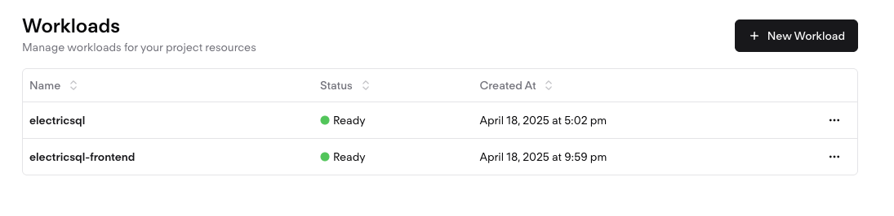
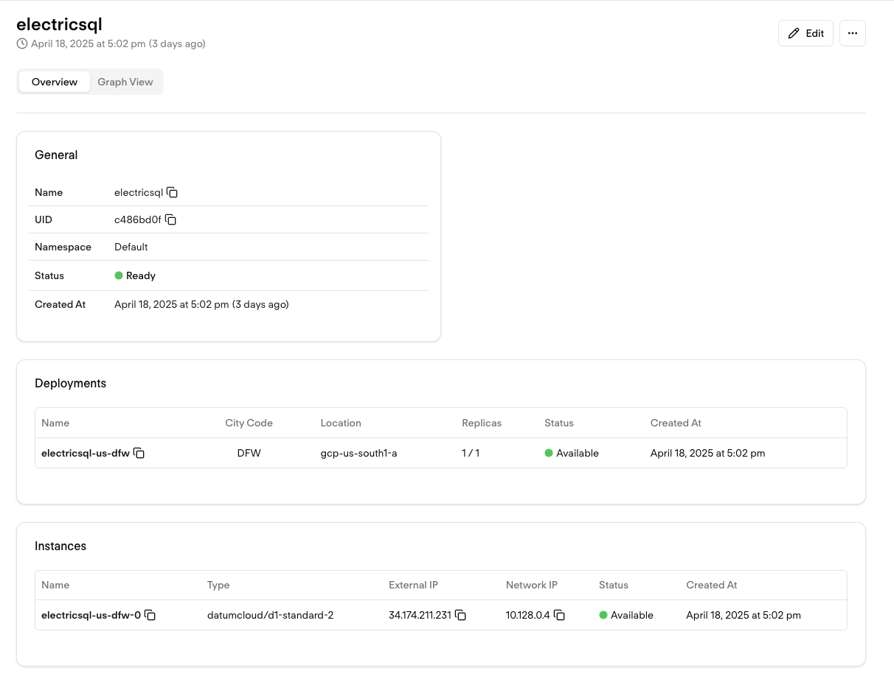
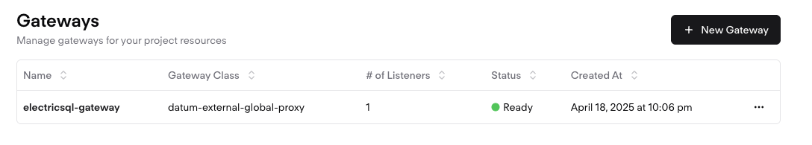

# ElectricSQL-on-Datum
Deploy ElectricSQL on Datum with a simple Kustomize Manifest

[Electric](https://electric-sql.com/) builds sync for making apps awesome.

This guide is based upon Electric's [quickstart](https://electric-sql.com/docs/quickstart).

## Requirements

The following pre-requisites are required to deploy ElectricSQL on Datum:

- Working Datum CLI tools [documentation](https://docs.datum.net/docs/tasks/tools/)
- A Datum project with compute backed by GCP [documentation](https://docs.datum.net/docs/tasks/create-project/)
- PostgresSQL instance with Logical Replication enabled (consider your own PostgresSQL or Neon). 
- The docker container providing the React frontend app has been built to query data from ElectricSQL's sample data in the `scores` table. Again, see Electric's [quickstart](https://electric-sql.com/docs/quickstart) for data model and sample data.

## Architecture

The Kustomize manifests in this repository deploy the following:

- ElectricSQL backend hosted in GCP with the Datum Gateway (Anycast Proxy) as global ingress.
- ElectricSQL's demo React application as a frontend, also hosted in GCP with the same Datum Gateway as a global ingress service.

## Deployment

### Prepare Database

- Create a database (in PostgresSQL) or a Project (in Neon).
- Prepare a PostgresSQL instance at a location of your choice. You will need to obtain full credentials including username, password, hostname/IP, and port number. Use of TLS is strongly suggested.
- Postgres must have [logical replication enabled](https://www.postgresql.org/docs/current/logical-replication-config.html). You also need to connect as a database role that has the REPLICATION attribute.
- If using NeonDB, enable Logical Replication in your project settings.

### Populate Sample Data

Using standard database tools, create and populate a new table, called `scores` with Electric's sample data avaialble from their [quickstart](https://electric-sql.com/docs/quickstart).

Create the table:
```
CREATE TABLE scores (
  id SERIAL PRIMARY KEY,
  name VARCHAR(255),
  value FLOAT
);
```
Populate the table:
```
INSERT INTO scores (name, value) VALUES
  ('Alice', 3.14),
  ('Bob', 2.71),
  ('Charlie', -1.618),
  ('David', 1.414),
  ('Eve', 0);
```

### Clone Repository

- Clone this repository locally to have Kustomize files available for modification to your environment.

### Prepare Kustomize Manifests

- Deploy Locations and Networks: Adjust `location-network/locations.yaml` to your preferences for a GCP backed compute location. If we decided to alter location city codes, you will need to make corresponding updates to the `workload-*/workload.yaml` manifests.

- Define your PostgresSQL backend of choice in `workload-electricsql/workload.yaml. 

### Deploy using Kustomize

- Deploy Networks and Locations with `kubectl apply -k location-network`
- Deploy ElectricSQL with `kubectl apply -k workload-electricsql`. You can monitor your deployment with `kubectl get instances`.
- Deploy the ElectricSQL demo React app with `kubectl apply -k workload-frontend`. You can monitor your deployment with `kubectl get instances`.

### Update Gateway Endpoints with Backend IPs

- Use `kubectl get instances -o wide` to locate the External IPs for ElectricSQL and Frontend instances.
- Update `gateway/endpoints.yaml` with External IPs for ElectricSQL and Frontend EndpointSlices
- Deploy the Datum Gateway using `kubectl apply -k gateway`.
- Discover your assigned Datum Gateway endpoint using `kubectl get gateways -o wide`.

## Test your ElectricSQL Deployment

- Use a browser to navigate to the FQDN listed in `kubectl get gateways -o wide`. The ElectricSQL demo React application should load, displaying the sample data from the `scores` table in JSON format.
- Use a PostgresSQL client to modify the data in the `scores` table, noting real time updates to the JSON structure in your browser window.

## Where to go from here?

- See your deployment in [Datum Cloud Portal](https://cloud.datum.net/login).
- Enable TLS/SSL on your Datum Gateway with your own domain name via CNAME and a certificate from Let's Encrypt.
- Setup a Telemetry Exporter for your deployment to Grafana Cloud to get metrics from your Datum deployment. 

## Screenshots




